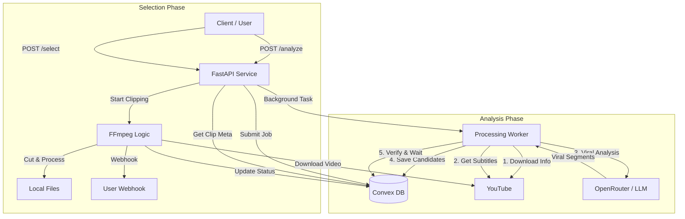

# Product Requirements Document (PRD) - YT Clipper Service

## 1. Overview

YT Clipper Service is an API-based tool that automatically identifies, clips, and processes viral segments from YouTube videos using AI. It transforms long-form content into short-form, mobile-optimized videos (TikTok/Reels/Shorts style) with burn-in subtitles.

## 2. Architecture

## 3. Data Flow

1.  **Analysis Request**: User provides YouTube URL.
2.  **Ingestion**: System fetches metadata and subtitles.
3.  **AI Processing**: Subtitles are sent to LLM to find "viral" hooks (funny, high energy, shocking).
4.  **Proposal**: System stores candidate clips in Convex DB with a "virality score".
5.  **Selection**: User (or automated agent) selects a specific candidate clip ID.
6.  **Production**:
    - Full video is downloaded (if not cached).
    - Segment is cut.
    - Video is cropped to 9:16 (Vertical).
    - Subtitles are burned in with "viral style" formatting.
7.  **Delivery**: Resulting file path is updated in DB and webhook is triggered.

## 4. Key Features

- **AI-Powered Discovery**: Uses LLMs to understand context and sentiment, not just keyword matching.
- **Vertical Optimization**: Automatically centers and crops landscape video for mobile viewing.
- **Dynamic Subtitles**: Hardcoded subtitles with high-contrast styles.
- **State Management**: Real-time status tracking via Convex DB.
- **Async Processing**: Non-blocking API for scalability.

## 5. Technology Stack

- **Core**: Python 3.9+
- **API**: FastAPI
- **Database**: Convex (Realtime Backend-as-a-Service)
- **AI**: OpenAI SDK (via OpenRouter)
- **Media Processing**: FFmpeg + Libass
- **Downloads**: yt-dlp
